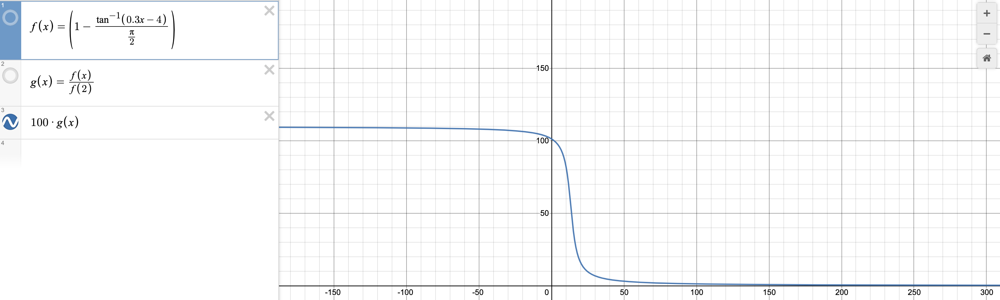

# Fishing detector

## Сборка (уже собрано)

```sh
yarn install
yarn webpack
```

## Установка

Заходим в расширения Chrome, включаем режим разработчика. Нажимаем "Загрузить распакованное расширение", выбираем папку `dist`. Расширение активировано.

## Функционал

Если сайт похож на фишинговый, предупреждаем пользователя заметным сообщением. По нажатию на кнопку объясняем, почему сайт подозрительный.

### Критерии проверки

За каждый критерий мы начисляем определенное количество баллов. Если сумма баллов за все критерии >= 90, то сайт считается фишинговым.

- Дата регистрации сайта - если сайт зарегистрирован менее двух недель назад, это подозрительно. Конечно, далеко не все такие сайты фишинговые, но пользователи, как правило, и не заходят на такие сайты, если только им никто не скинул ссылку. Поэтому вероятность того, что пользователь попал именно на фишинговый сайт, довольно высока. Количество баллов за определенную дату регистрации считаем с помощью функции. 


Если сайт зарегистрирован в последние две недели, то мы начисляем 90 баллов. 

- Уровень домена - если у сайта длинная цепочка поддоменов, это подозрительно.
За этот критерий мы начисляем 20 баллов. 

- Отстутствие HTTPS.
За этот критерий мы начисляем 30 баллов. 

- Наличие сайта в базах фишинговых сайтов. 
Сейчас используется фишинговая база ``https://loxotrons.ru/``.
За этот критерий мы начисляем 90 баллов.

Примеры сайтов, на которых сработает наше расширение:  
https://000752749225.ru/ - по причине создания сайта в последние две недели.  
https://uusvideo.xyz/ -  по причине наличия сайта в базе фишинговых сайтов. 
